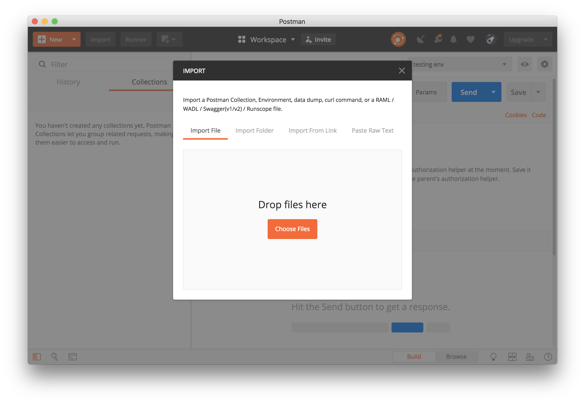

:github-readme: ../README.adoc

include::{github-readme}[tags=vardef]

:projectpage: https://github.com/{gh-repo-owner}/{gh-repo-name}

include::{github-readme}[tags=header]

== URLs

* link:{homepage}[Project home] (this page)
* link:{projectpage}[GitHub project]
* link:{talkpage}[Session page] on the EclipseCon website
* link:{issues}[Issue tracker]

TIP: Do you want to improve this page? Please git-link:self[edit it on GitHub, edit].

include::{github-readme}[tags=description]

=== OpenAPI specification

The git-link:OpenAPI-Spec/[OpenAPI-Spec] folder contains the OpenAPI specification for the Todo-Application.

Open it in Swagger-Editor online:

* link:https://editor.swagger.io/?url=https://raw.githubusercontent.com/jmini/ece2018-openapi/master/OpenAPI-Spec/todoapp.yaml[todoapp.yaml]
* link:https://editor.swagger.io/?url=https://raw.githubusercontent.com/jmini/ece2018-openapi/master/OpenAPI-Spec/todoapp.v2.yaml[todoapp.v2.yaml]

=== Postman collection

The postman collection can be found here: git-link:Postman/todoapp.postman_collection.json[`Postman/todoapp.postman_collection.json`]

You can get the same result if you import the git-link:OpenAPI-Spec/todoapp.v2.yaml[`todoapp.v2.yaml`] file into Postman.



=== Server implementation

There are 2 server implementation based on Thorntail.

* git-link:todoapp_jaxrs/[todoapp_jaxrs]: JAX-RS only
* git-link:todoapp/[todoapp]: JAX-RS + OpenAPI Microprofile

To start the application just run following command inside a project:

```
mvn thorntail:run
```

The server is started on port `8080`.

If you start version with the OpenAPI support the generated spec is available at:

```
http://localhost:8080/openapi
```

=== Client implementation

The OpenAPI-Generator jar is prepared in the git-link:todoapp_client/[todoapp_client] folder.

include::../todoapp_client/README.adoc[]


== Talk

=== Abstract

> The OpenAPI Specification (formally known as Swagger) describes APIs in a way that is standardized, machine-readable, and programming language-agnostic. It is an open source project hosted by the Linux Foundation.
> 
> There have been many announcements regarding frameworks or tools supporting this standard: For example, Eclipse MicroProfile 1.3 provides a set of annotations that can be used on top of JAX-RS, and version 3.5.2 of Eclipse Vert.x provides automatic requests validation.
> 
> The standard is also well-adopted. Many products describe their API as an OpenAPI Specification: Docker, OpenShift, Microsoft Azure, to name a few. The government of Netherlands has adopted the OpenAPI Specification as a national standard.
> 
> This talk will provide an overview of the specification format, then it will present some implementation examples with different frameworks. Useful tools; such as an editor based on Eclipse Xtext and a code generator, will also be presented. The examples here are taken from real projects.
> 
> All of the tools presented in this talk are open-source.

=== Slides

Slides: link:OpenAPI_are_erverywhere.pdf[OpenAPI_are_erverywhere.pdf]


include::{github-readme}[tags=contact-section]

include::{github-readme}[tags=license-section]
